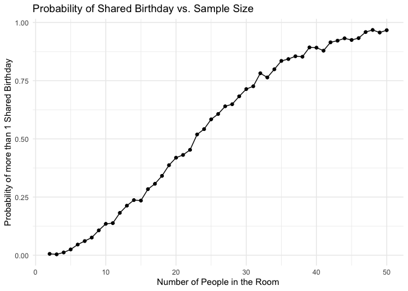
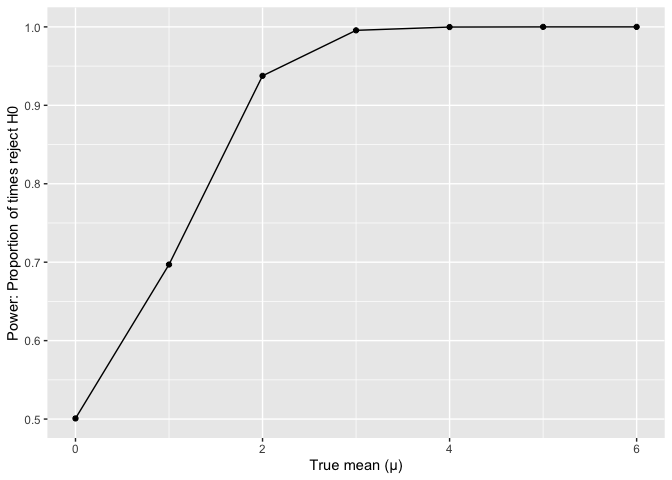
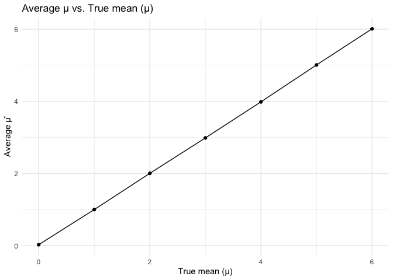
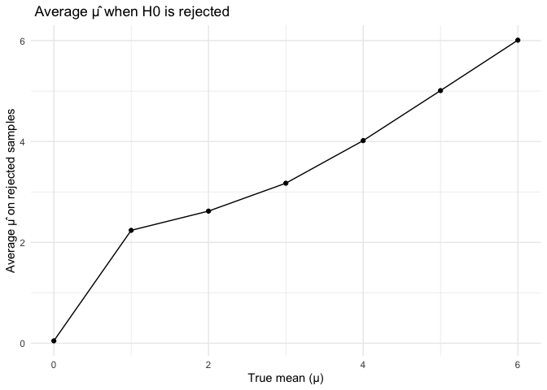

p8105_hw5_ym3077
================

Load package

``` r
library(tidyverse)
```

    ## ── Attaching core tidyverse packages ──────────────────────── tidyverse 2.0.0 ──
    ## ✔ dplyr     1.1.4     ✔ readr     2.1.5
    ## ✔ forcats   1.0.0     ✔ stringr   1.5.1
    ## ✔ ggplot2   3.5.2     ✔ tibble    3.3.0
    ## ✔ lubridate 1.9.4     ✔ tidyr     1.3.1
    ## ✔ purrr     1.1.0     
    ## ── Conflicts ────────────────────────────────────────── tidyverse_conflicts() ──
    ## ✖ dplyr::filter() masks stats::filter()
    ## ✖ dplyr::lag()    masks stats::lag()
    ## ℹ Use the conflicted package (<http://conflicted.r-lib.org/>) to force all conflicts to become errors

``` r
library(broom)
set.seed(1)
```

## Problem 1

Write a function that simulates birthdays and checks for duplicates

``` r
bday_sim = function(n_people) {
  
  birthdays = sample(1:365, size = n_people, replace = TRUE)

  repeated_bday = length(unique(birthdays)) < n_people

  repeated_bday
  
}
```

Run this function 10000 times for each group size between 2 and 50. For
each group size, compute the probability that at least two people in the
group will share a birthday by averaging across the 10000 simulation
runs.

``` r
bday_results = 
  expand_grid(
    group_size = 2 :50,
    iter = 1:1000) |>
  mutate(share_bday = map_lgl(group_size, bday_sim)) |>
  group_by(group_size) |>
  summarize(prob_sharebday = mean(share_bday))
```

Make a plot showing the probability as a function of group size, and
comment on your results.

``` r
bday_results |> 
  ggplot(aes(x = group_size, y = prob_sharebday)) +
  geom_point() +
  geom_line() +
  labs(
    title = "Probability of Shared Birthday vs. Sample Size",
    x = "Number of People in the Room",
    y = "Probability of more than 1 Shared Birthday"
  ) +
  theme_minimal()
```

<!-- -->

This plot shows the estimated probability of at least 2 people in a
group share the same birthday, for group sizes varying from 2 to 50. The
probability is very low for small groups (less than 5), and rises
rapidly for groups with 15-30 people, finally approaches to 1 as the
group size nears 50.

## Problem 2

Make a plot showing the proportion of times the null was rejected (the
power of the test) on the y axis and the true value of𝜇on the x axis.
Describe the association between effect size and power.

Function Set up and Run 5000 simulations for μ = 0,1,2,3,4,5,6

``` r
n = 30
sigma = 5
sim_one <- function(mu) {
  x <- rnorm(n = n, mean = mu, sd = sigma)
  ttest <- t.test(x, mu = 0)
  tidy(ttest) |>
    select(estimate, p.value) |>
    rename(mu_hat = estimate) 
}

sim_results <-
  expand_grid(
    true_mu = 0:6,
    iter = 1:5000) |>
  mutate(output = map(true_mu, sim_one)) |>
  unnest(output)
```

Make a plot showing the proportion of times the null was rejected (the
power of the test) on the y axis and the true value of 𝜇 on the x axis.
Describe the association between effect size and power.

``` r
power_df <-
  sim_results |>
  group_by(true_mu) |>
  summarize(power = mean (p.value <0.5)) |>
  ggplot(aes(x = true_mu, y = power)) +
  geom_point() +
  geom_line() +
  labs( titble = "Power of One-Sample T-Test",
        x = "True mean (μ)",
        y = "Power: Proportion of times reject H0"
  )
power_df
```

<!-- -->

The plot shows power increases as the true mean (μ) increases. Since the
H0: μ = 0, and population standard deviation is fixed at 5, as true mean
(μ) increases to 1, 2, 3 and higher, the effect size increases, the test
is increasingly likely to detect the mean is not zero, and power rises
sharply approaching to 1 for μ = 4.

Make a plot showing the average estimate of 𝜇̂ on the y axis and the true
value of 𝜇 on the x axis.

``` r
avg_est <- sim_results |>
  group_by(true_mu) |>
  summarize(avg_mu_hat = mean(mu_hat))

ggplot(avg_est, aes(x = true_mu, y = avg_mu_hat)) +
  geom_point() +
  geom_line() +
  labs(
    title = "Average μ vs. True mean (μ)",
    x = "True mean (μ)",
    y = "Average μ̂")+
  theme_minimal()
```

<!-- -->

Make a second plot (or overlay on the first) the average estimate of 𝜇̂
only in samples for which the null was rejected on the y axis and the
true value of 𝜇 on the x axis.

``` r
avg_reject <-
  sim_results |>
  filter(p.value < 0.05) |>
  group_by(true_mu) |>
  summarize(mu_hat_reject = mean(mu_hat))

ggplot(avg_reject, aes(x = true_mu, y = mu_hat_reject)) +
  geom_point() +
  geom_line() +
  labs(
    title = " Average μ̂ when H0 is rejected",
    x = "True mean (μ)",
    y = "Average μ̂ on rejected samples"
  ) +
  theme_minimal()
```

<!-- -->

Is the sample average of 𝜇̂ across tests for which the null is rejected
approximately equal to the true value of 𝜇? Why or why not? No,
according to the plot the sample average of μ_hat among only the
rejected samples is not equal to the true mean (μ), especially when true
mean (μ) is small. Because rejecting H0 requires extreme estimates
(sample mean to be far enough from 0) to produce a small p-value. As
true mean (μ) gets larger and the test has higher power, nearly all
samples are included in the “rejecting” region, and all reject the null.
